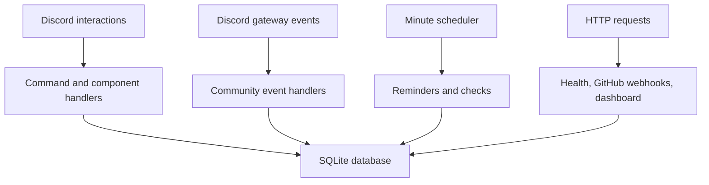

# Architecture / Arquitetura

[English](#english) · [Português](#português)

## English

The bot is a Node.js/TypeScript process built with discord.js. `src/index.ts` creates the client and starts event handling, a minute scheduler, and an HTTP server after the bot logs in. `src/handlers/interactions.ts` checks a command's module and configured role rules before invoking it.

| Location | Responsibility |
| --- | --- |
| `src/commands/` | Slash command definitions and execution. The original commands remain alongside the 2.0 commands. |
| `src/modules/plugins.ts` | Registers 2.0 command, button, modal, and select packages. |
| `src/modules/registry.ts` | Maps command names to per-server module switches. |
| `src/handlers/` | Dispatches Discord interactions to commands and component handlers. |
| `src/events/`, `src/v2/events.ts` | Message activity, welcome flow, anti-spam, starboards, onboarding-related events, voice rooms, and security alerts. |
| `src/services/` | Role/channel bootstrap, achievements, signed GitHub webhook handling, HTTP health and dashboard. |
| `src/v2/scheduler.ts` | Reminders, uptime checks, event notices, ticket inactivity, digests, focus timers, and stand-up prompts. |
| `src/database.ts`, `src/v2/store.ts` | Original SQLite schema and additive feature tables in the **same SQLite file**. |
| `tests/` | Database, utility, URL safety, and slash command registry checks. |

### Adding a module

1. Implement a `BotCommand` in `src/commands/`, using existing patterns for guild checks and ephemeral responses.
2. Add its name to the command-to-module map in `src/modules/registry.ts` and register it in `src/modules/plugins.ts` or `src/commands/index.ts` as appropriate.
3. Register any button, modal, or select handlers through the plugin registry. Prefer stable custom ID prefixes and verify guild ownership before editing stored items.
4. Store new state through an additive migration in `FeatureStore`, or reuse typed v2 items when appropriate. Never delete 1.0 tables during an upgrade.
5. Run `npm run check`, then `npm run deploy:commands` against a test server. Check permissions with a regular member and a staff account.

### Operational limits

- Module switches currently gate slash command entry. Some event handlers and scheduled work run separately; a module toggle is not a universal kill switch for existing jobs or buttons.
- The bot uses one process and a local SQLite file. Keep it on persistent storage and avoid running duplicate instances against that file.
- Message content is used for anti-spam, automatic threads, XP, and some community features. Both privileged intents listed in [Setup](SETUP.md) are required for the intended behavior.
- Ticket transcripts can include message content and attachment links. Treat ticket log channels and backups as private data.
- The dashboard uses a shared secret, not Discord OAuth login. Restrict access and use HTTPS when enabled.

## Português

O bot é um processo Node.js/TypeScript com discord.js. Após conectar ao Discord, `src/index.ts` ativa eventos, tarefas por minuto e o servidor HTTP. Antes de executar um slash command, `src/handlers/interactions.ts` verifica o módulo e as regras de cargo configuradas.

| Local | Responsabilidade |
| --- | --- |
| `src/commands/` | Definição e execução de comandos antigos e da versão 2.0. |
| `src/modules/plugins.ts` | Registro de comandos, botões, formulários e menus da versão 2.0. |
| `src/modules/registry.ts` | Relação entre nomes de comandos e módulos do servidor. |
| `src/handlers/` | Distribuição das interações do Discord. |
| `src/events/`, `src/v2/events.ts` | Mensagens, boas-vindas, anti-spam, starboard, salas de voz e alertas de segurança. |
| `src/services/` | Bootstrap de canais e cargos, conquistas, webhooks assinados, HTTP e painel. |
| `src/v2/scheduler.ts` | Lembretes, uptime, eventos, inatividade de tickets, digest, foco e stand-ups. |
| `src/database.ts`, `src/v2/store.ts` | Tabelas antigas e tabelas novas no **mesmo arquivo SQLite**. |
| `tests/` | Testes de banco, utilidades, URLs e registro de comandos. |

### Adicionar um módulo

1. Crie um `BotCommand` em `src/commands/`, usando os padrões existentes para servidor, permissões e respostas privadas.
2. Registre o nome em `src/modules/registry.ts` e inclua o comando em `src/modules/plugins.ts` ou `src/commands/index.ts`.
3. Registre botões, formulários e menus no plugin, verificando o ID do servidor antes de alterar dados guardados.
4. Para novos dados, use uma migração adicional em `FeatureStore` ou itens v2 existentes. Não apague tabelas da versão 1.0.
5. Execute `npm run check`, depois `npm run deploy:commands` no servidor de teste. Verifique a experiência de um membro comum e de um membro da staff.

### Limites atuais

- Os módulos controlam a entrada por slash command. Alguns eventos e agendamentos continuam independentes; desativar um módulo não encerra automaticamente jobs ou botões que já existem.
- O bot usa um processo e um arquivo SQLite local. Preserve a pasta `data` e evite executar duas instâncias sobre o mesmo banco.
- Parte da atividade depende do conteúdo das mensagens; ative os intents indicados em [Instalação](SETUP.md).
- Transcripts de tickets podem conter mensagens e links de anexos. Proteja canais de logs e backups.
- O dashboard usa um segredo compartilhado, não login OAuth do Discord. Restrinja o acesso e use HTTPS.
